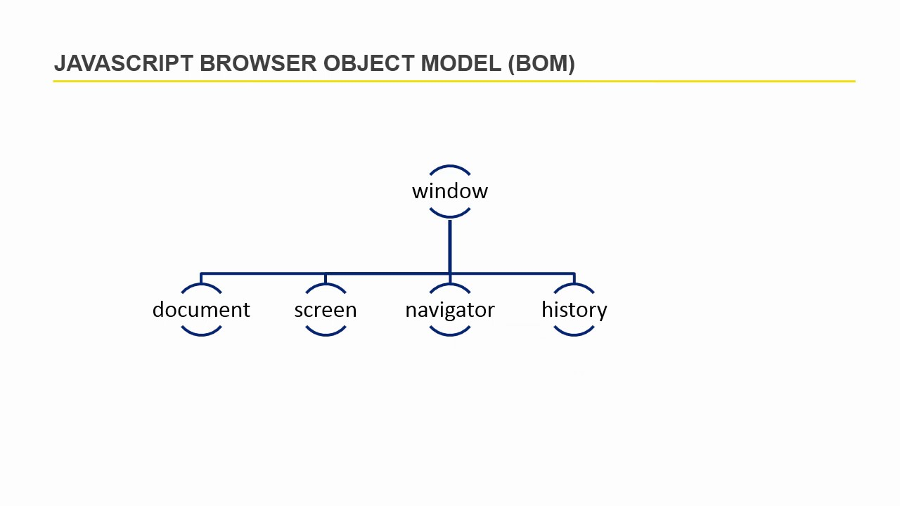
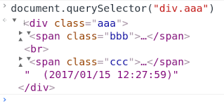
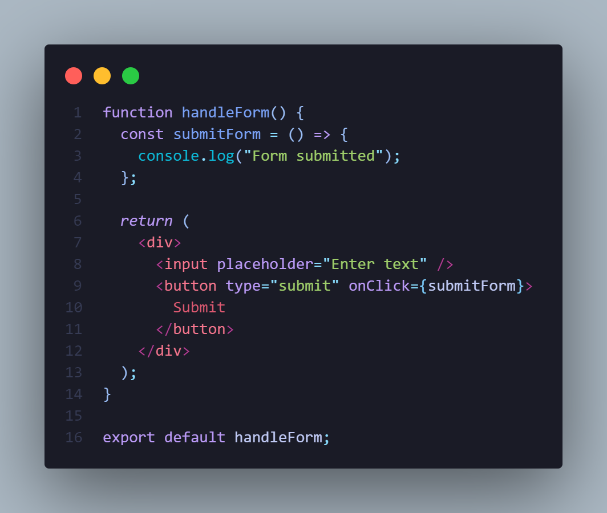
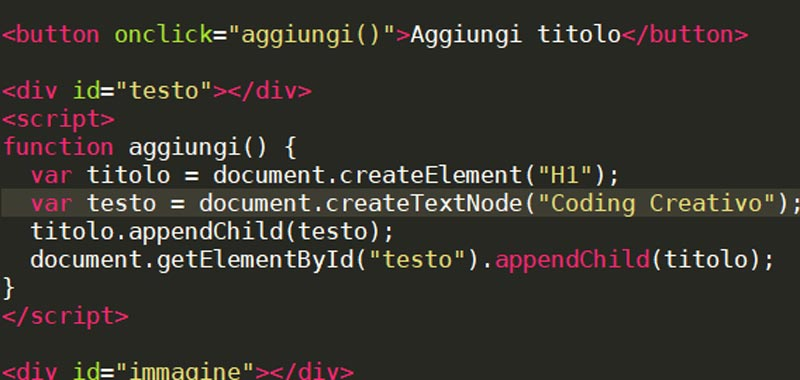
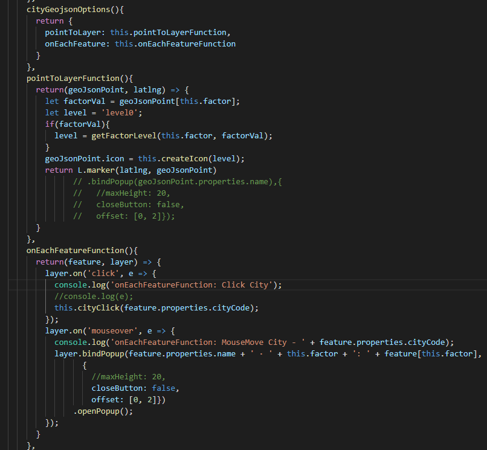
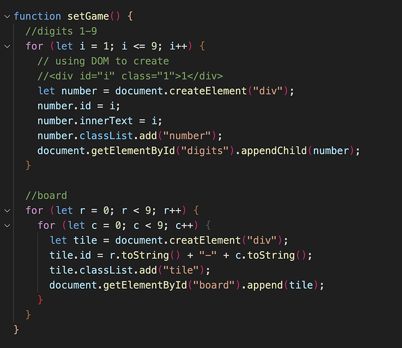

# Bom - дар javaScript чист?

## Bom ин brousers Object Model мебошад.Bom имкон медихад ки JS бо брузер сухбат кунад.

# Dom - дар javaScript чист?

## Dom ин Document Object Model мебошад. Dom ин як документай ки моделш объектай. Ранги структураи дарахтай.Сохтори дарахт, тавлидшуда тавассути браузер дар боркунии html.

# querySelector() - игн барои доступ пайдо кардан танхо ба як елемент.querySelectorAll() - ин барои доступ гирифтан барои хамаи елементхо истифода мешавад.

# innerHTML - Значенияе ки мо да ягон елемент ворид мекнем.

# onclick - ин сабитияе ки истифодабаранда зер мекунад.

# CreatElement - барои елемент сахдавать кардан дар тарафи JS.

# Append - Барои дабавить кардани елеменхо да html.

## AppendChild - Ин хам монанди append дабавит мекна танхо якта дабавить мекна.

# Classlist - барои ном додани елеменхои дар тарафи JS. Ва 3 хел мешавад: 1.add,2.remove,3.toggle

